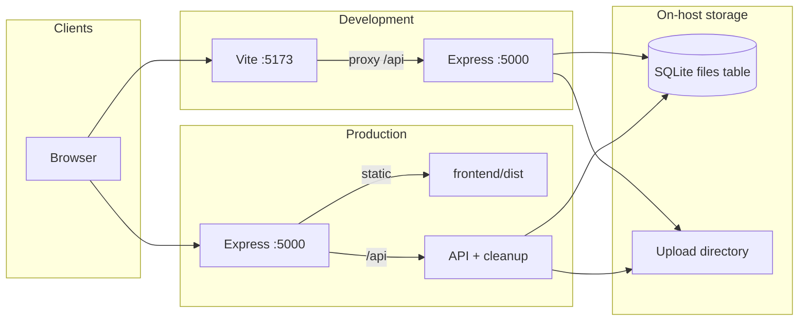
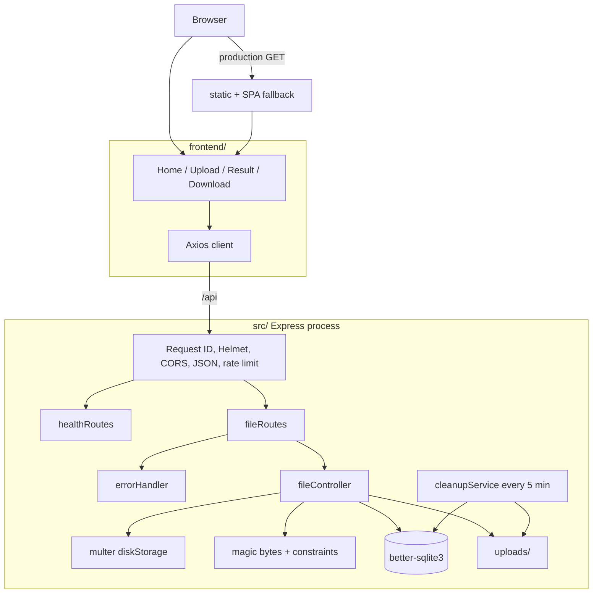
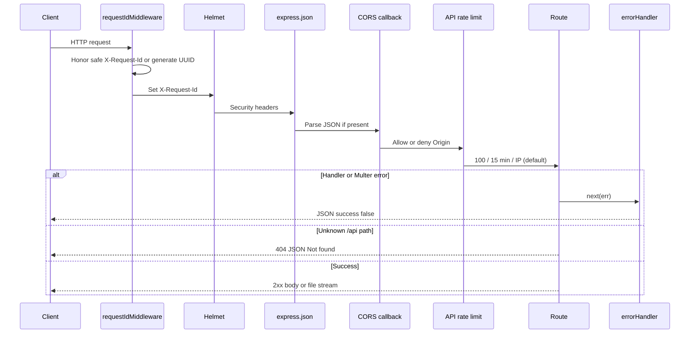
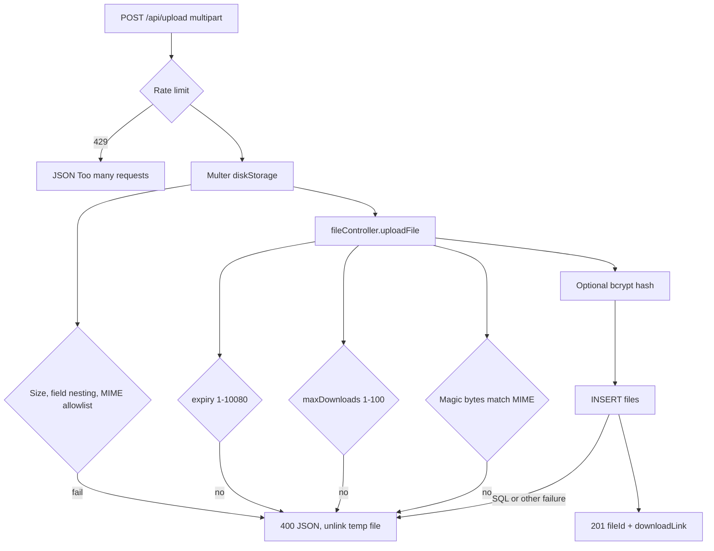
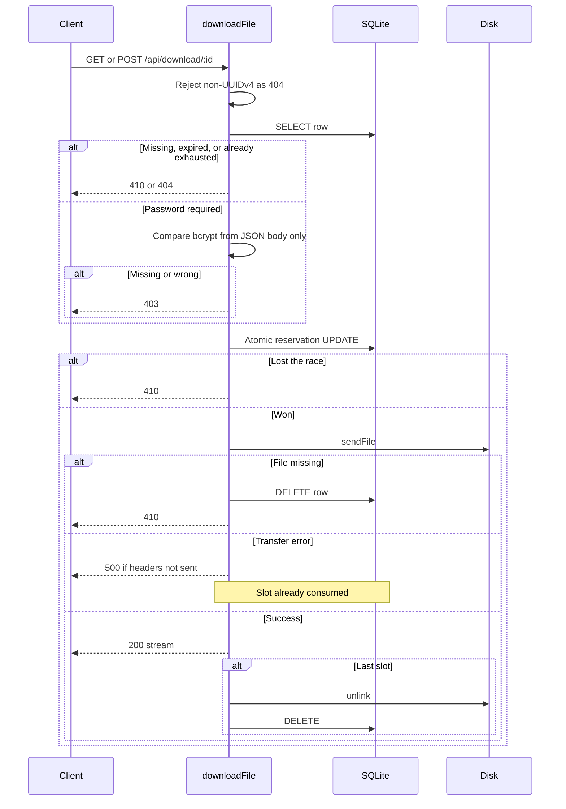
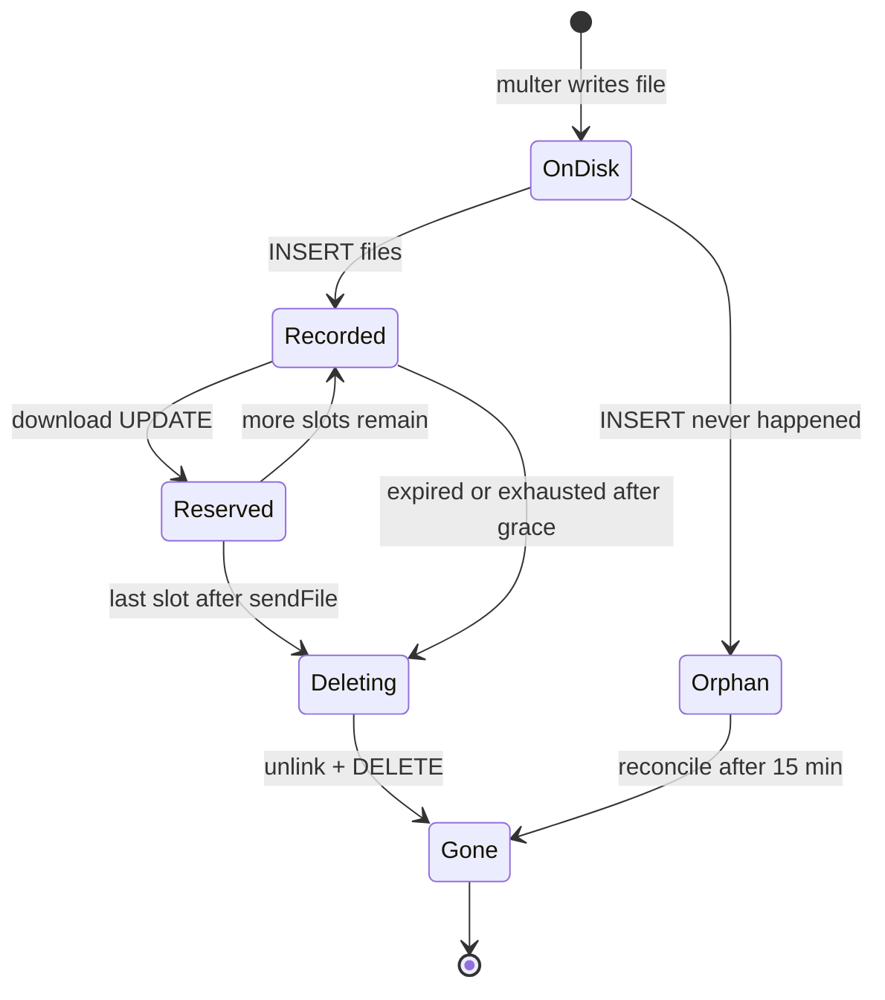
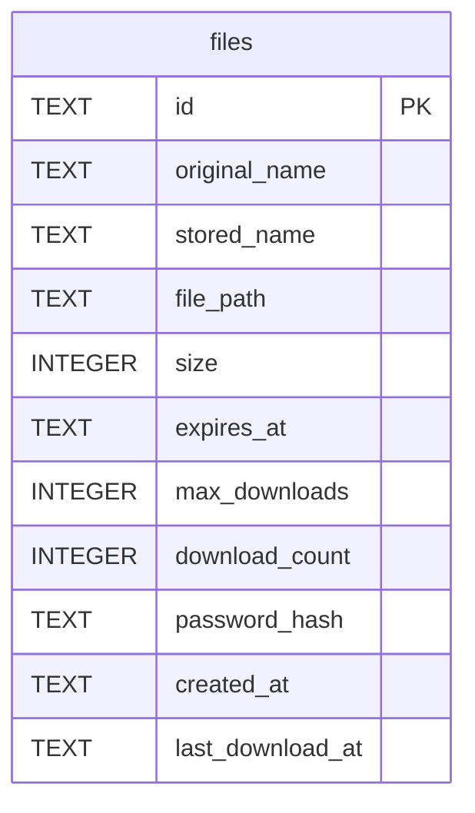
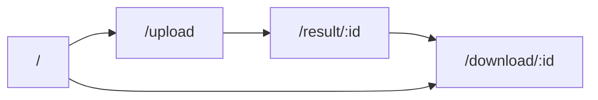
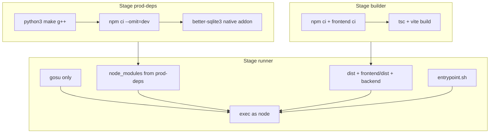
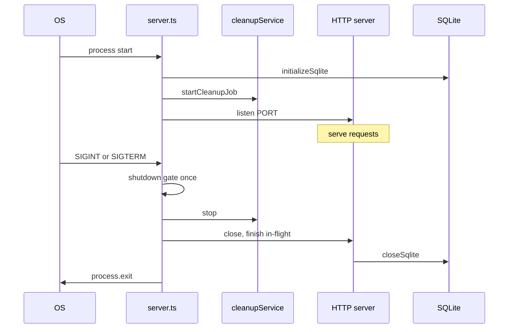

# DeadDrop

DeadDrop is a single-host anonymous file drop. A browser uploads a file, receives a UUIDv4 link, and anyone with that link (plus an optional password) can download the file until it expires or its download limit is reached.

The product is intentionally small: one Express process, one SQLite file, one upload directory. There is no user account system, no object store, and no end-to-end encryption. Files are stored as plaintext bytes on disk. Anyone who has the link and password can read them. Transport encryption is whatever TLS a reverse proxy provides.

License: MIT. Runtime: Node.js 20.

---

## Contents

1. [What it does](#what-it-does)
2. [System context](#system-context)
3. [Architecture](#architecture)
4. [Request pipeline](#request-pipeline)
5. [Upload design](#upload-design)
6. [Download and reservation](#download-and-reservation)
7. [Cleanup and file lifecycle](#cleanup-and-file-lifecycle)
8. [Data model](#data-model)
9. [Frontend](#frontend)
10. [Docker and production](#docker-and-production)
11. [Process lifecycle](#process-lifecycle)
12. [Security model](#security-model)
13. [Observability](#observability)
14. [Data retention](#data-retention)
15. [API](#api)
16. [Environment](#environment)
17. [Local setup](#local-setup)
18. [Tests and CI](#tests-and-ci)
19. [Repository layout](#repository-layout)
20. [Limits of the design](#limits-of-the-design)

---

## What it does

| Capability | Behavior |
| --- | --- |
| Anonymous upload | No accounts. The response is a file ID and a download path. |
| Expiry | 1 to 10080 minutes (7 days). UI presets: 60, 1440, 10080. |
| Download limit | 1 to 100. Default 1. |
| Password | Optional. bcrypt hash only. Body `{ "password" }`, never `?password=`. |
| File types | JPEG, PNG, PDF, TXT, ZIP. Magic bytes must match the declared MIME type. |
| Size | 10 MB maximum. Empty files rejected. |
| Sharing | Result page copies a `/download/:id` URL. Download page loads public metadata first. |

---

## System context

Two ways to run it: Vite plus the API in development, or one container that serves both the built SPA and the API in production.



There is no Redis, no message queue, no object storage, and no external database. Rate limits and logs live in the process. Persistence is two directories.

---

## Architecture

### Logical components



### Backend module map

| Area | Path | Role |
| --- | --- | --- |
| Process entry | `src/server.ts` | Listen, start cron, SIGINT/SIGTERM shutdown |
| App wiring | `src/app.ts` | Middleware order, routes, SPA fallback |
| Upload / download / info | `src/controllers/fileController.ts` | Business rules |
| Routes | `src/routes/fileRoutes.ts`, `healthRoutes.ts` | HTTP surface |
| SQLite | `backend/database/sqlite-setup.js` | Path, pragmas, schema, singleton |
| Cleanup | `src/services/cleanupService.ts` | Expiry, exhausted rows, orphan files |
| Limits | `src/utils/uploadConstraints.ts`, `multer.ts`, `fileValidation.ts` | Size, MIME, magic bytes |
| Security config | `src/config/helmet.ts`, `cors.ts`, `trustProxy.ts` | Headers, origin, proxy hops |
| Cross-cutting | `src/middleware/requestId.ts`, `rateLimits.ts`, `errorHandler.ts` | IDs, 429, JSON errors |
| Logs | `src/utils/logger.ts` | Structured JSON on stdout |

### Frontend module map

| Area | Path | Role |
| --- | --- | --- |
| Routes | `frontend/src/App.tsx` | `/`, `/upload`, `/result/:id`, `/download/:id` |
| API | `frontend/src/services/api.ts` | Upload, info, GET/POST download |
| Base URL | `frontend/src/services/apiBaseUrl.ts` | `VITE_API_BASE_URL` or `/api` |
| Layout | `frontend/src/layouts/RootLayout.tsx` | Shell, nav |

---

## Request pipeline

Every `/api` request walks the same stack before a route handler.



Upload and download add a second limiter on the route:

- Upload: 20 requests per hour per IP
- Download and password POST: 10 requests per 15 minutes per IP

`TRUST_PROXY` (default `1`) tells Express how many hops to trust so those counters use the real client address behind Docker or a reverse proxy.

---

## Upload design



Stored name on disk is a new UUIDv4 plus an extension derived from the validated MIME type, not from the client filename. The original name is kept only as metadata for `Content-Disposition`.

Multer limits used by this app:

- `fileSize`: 10 MB
- `files`: 1
- `fields`: 8
- `fieldNameSize`: 64
- `fieldNestingDepth`: 0
- `fieldArrayIndexLimit`: 0

Those last two close multipart parser denial-of-service cases that need nested or huge array indexes. DeadDrop only uses flat fields: `file`, `expiryMinutes`, `maxDownloads`, `password`.

---

## Download and reservation

A download slot is reserved in SQLite **before** `sendFile`. The update is atomic:

```sql
UPDATE files
SET download_count = download_count + 1,
    last_download_at = ?
WHERE id = ?
  AND download_count < max_downloads
  AND expires_at > ?
```

If `changes === 0`, the client gets 410. Two concurrent requests for `maxDownloads = 1` produce one 200 and one 410.



Failed transfers still consume the reserved slot. That is deliberate: a partial download of a one-time secret must not be retryable.

Password-protected files must use `POST` with JSON. `GET /api/download/:id?password=` is ignored and returns 403 if a hash exists.

---

## Cleanup and file lifecycle

`node-cron` runs `performCleanupRound` every five minutes.

A row is eligible when it is expired **or** exhausted, **and** it was not reserved in the last five minutes (`last_download_at` older than the grace window, or null on legacy rows). That grace exists so cleanup cannot `unlink` a file that `sendFile` is still streaming.

After database cleanup, `reconcileStorageDirectory` deletes files in `UPLOAD_DIR` that are not referenced by any row and are older than 15 minutes (so an in-progress multer write is not removed).



---

## Data model

SQLite, WAL, foreign keys on, `busy_timeout = 5000`. New databases create only `files`. Older databases may still contain unused `users` / `messages` tables; they are never dropped.



Indexes: `expires_at`, `created_at`, and a partial index on exhausted downloads (`download_count >= max_downloads`).

`last_download_at` is added with `ALTER TABLE` when missing so existing files databases keep their rows.

---

## Frontend

React 19 + Vite + React Router (declarative `BrowserRouter`). Axios calls `/api` unless `VITE_API_BASE_URL` is set.



| Page | Behavior |
| --- | --- |
| `/` | Marketing / entry |
| `/upload` | Drag-and-drop, expiry, max downloads, optional password. Keyboard-operable drop zone. |
| `/result/:id` | Loads `/api/file/:id/info`, shows share URL, copy with clipboard fallback |
| `/download/:id` | Loads metadata first; password field if `hasPassword`; then GET or POST download |

In development, Vite proxies `/api` to `http://localhost:5000`. In production the API serves `frontend/dist` from the same origin, so the browser keeps calling `/api`.

---

## Docker and production

Multi-stage image on `node:20-bookworm-slim`.



The compiler toolchain never lands in the runtime image. `better-sqlite3` is compiled on the same OS/glibc as the runner.

`docker/entrypoint.sh` creates `UPLOAD_DIR` and the SQLite parent directory, `chown`s them to `node`, then `exec gosu node`. Compose mounts named volumes for `/app/backend/database` and `/app/uploads`.

Health: `GET /api/ready` (SQLite `SELECT 1` plus a write probe in the upload directory). `GET /api/health` is liveness only and stays 200 even if SQLite is closed.

```bash
docker compose up --build
```

Listens on port 5000. `NODE_ENV=production`, `TRUST_PROXY=1`. CORS defaults to same-origin in production.

---

## Process lifecycle



A second signal is ignored so `server.close` is not called twice. If close hangs, a 10 second timer exits with status 1.

---

## Security model

DeadDrop is a link-secrecy system, not a cryptography product.

| Control | Implementation |
| --- | --- |
| Unpredictable IDs | UUIDv4, rejected unless they match the v4 pattern |
| Password | bcrypt; POST body only |
| Type safety | MIME allowlist + magic-byte check |
| Filename | Stored name is UUID + server extension; `Content-Disposition` strips CR/LF |
| Upload DoS | Size cap, field nesting 0, rate limits |
| Download DoS / brute force | Per-IP download limiter |
| Headers | Helmet (CSP `default-src 'self'`, nosniff, SAMEORIGIN, no-referrer) |
| CORS | Callback allowlist. Dev default `http://localhost:5173`. Production default: no cross-origin. |
| Request IDs | Only `[A-Za-z0-9._-]{1,128}`; otherwise a new UUID |
| Errors | `{ "success": false, "message": "..." }`. No stacks, paths, or SQL. Invalid JSON is 400 without echoing the body. |
| Process | Container runs as `node` after entrypoint |

What this does **not** provide:

- Encryption at rest or end-to-end encryption
- Shared rate limits across multiple replicas (in-process only)
- Authentication of uploaders
- Scanning for malware beyond type checks

---

## Observability

Stdout is JSON lines. The logger drops `password`, `password_hash`, `authorization`, `cookie`, `body`, `file`, and `contents` if they are ever passed in.

Typical events: `startup`, `shutdown`, `upload_success`, `upload_fail`, `download_success`, `download_fail`, `password_fail`, `rate_limited`, `cleanup`, `server_error`, `request_fail`.

Fields that may appear: `ts`, `level`, `event`, `requestId`, `method`, `path`, `status`, `fileId`, `size`, `expiredDeleted`, `orphanedDeleted`, `signal`, `message`.

There is no OpenTelemetry, Prometheus, or log vendor. Retain logs with the container runtime.

---

## Data retention

Kept until cleanup:

- File bytes (plaintext)
- Metadata listed in the data model, including optional bcrypt hash

Not persisted:

- Client IP (memory only, for rate limits)
- Passwords in any reversible form
- File contents in logs

Cleanup cadence: 5 minutes. Orphan grace: 15 minutes. In-flight download grace: 5 minutes after `last_download_at`.

---

## API

All successful and failed API responses are JSON except a successful download, which is the file stream with `Content-Disposition`.

| Method | Path | Purpose |
| --- | --- | --- |
| GET | `/api/health` | Liveness |
| GET | `/api/ready` | SQLite + writable upload dir |
| POST | `/api/upload` | Multipart `file`; optional `expiryMinutes`, `maxDownloads`, `password` |
| GET | `/api/file/:id/info` | Public metadata (no hash) |
| GET | `/api/download/:id` | Unprotected download |
| POST | `/api/download/:id` | JSON `{ "password" }` for protected files |

Info payload (200):

```json
{
  "success": true,
  "file": {
    "id": "uuid",
    "originalName": "report.pdf",
    "size": 1234,
    "expiresAt": "ISO-8601",
    "maxDownloads": 3,
    "downloadCount": 1,
    "hasPassword": true,
    "createdAt": "ISO-8601"
  }
}
```

Common errors: 400 validation, 403 password, 404 bad id, 410 gone, 429 rate limit, 500 generic.

---

## Environment

Root `.env` (copy `.env.example`):

| Variable | Default | Purpose |
| --- | --- | --- |
| `PORT` | `5000` | Listen port |
| `NODE_ENV` | `development` | Mode; production CORS is same-origin |
| `TRUST_PROXY` | `1` | Express trust proxy |
| `CORS_ORIGIN` | unset | `*`, `false`, or comma-separated origins |
| `SQLITE_PATH` | `backend/database/deaddrop.db` | Database file |
| `UPLOAD_DIR` | `uploads` | Stored files |
| `RATE_LIMIT_API_MAX` / `_WINDOW_MS` | `100` / `900000` | Global `/api` |
| `RATE_LIMIT_UPLOAD_MAX` / `_WINDOW_MS` | `20` / `3600000` | Upload |
| `RATE_LIMIT_DOWNLOAD_MAX` / `_WINDOW_MS` | `10` / `900000` | Download |

Frontend (`frontend/.env`): `VITE_API_BASE_URL` defaults to `/api`. Vite does not read the root `.env`.

---

## Local setup

```bash
git clone https://github.com/isthatpratham/DeadDrop.git
cd DeadDrop
copy .env.example .env
npm install
npm run dev
```

API: http://localhost:5000

```bash
cd frontend
copy .env.example .env
npm install
npm run dev
```

UI: http://localhost:5173 (proxies `/api` to port 5000)

Production-style single process after `npm run build:all`:

```bash
npm start
```

---

## Tests and CI

```bash
npm test
npm run build
npm --prefix frontend test
npm --prefix frontend run build
```

Vitest points `SQLITE_PATH` and `UPLOAD_DIR` at a temp directory so developer data is never touched. GitHub Actions (`.github/workflows/ci.yml`) runs the same install, test, and build steps on Node 20 for pull requests and pushes to `main`.

---

## Repository layout

```
DeadDrop/
  backend/database/     SQLite bootstrap (JS + types)
  docker/entrypoint.sh  Volume chown, drop to node
  frontend/             Vite + React SPA
  src/                  Express API (TypeScript)
  src/__tests__/        Isolated API and security tests
  uploads/              Runtime files (gitignored)
  .env.example
  Dockerfile
  docker-compose.yml
  package.json
```

---

## Limits of the design

- Single instance. Two containers do not share rate-limit counters or take coordinated locks beyond SQLite.
- Files are readable to anyone who can read the volume or the SQLite file.
- A lost or failed download still burns a reserved slot.
- There is no admin UI, audit log store, or virus scanner.

If you need client-side encryption, encrypt before upload. The server will store that blob as-is and still enforce expiry and download limits on the opaque bytes.

---

## License

MIT. See [LICENSE](LICENSE).

## Author

[Pratham](https://github.com/isthatpratham)
